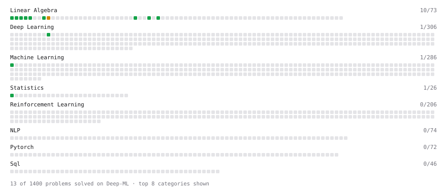

# Deep-ML

My machine learning practice from [Deep-ML](https://www.deep-ml.com). Every solution here was written by hand.

**20** solved · 20 problems · 0 labs · 0 math

[**Browse the interactive portfolio**](https://aryan-ml.github.io/deep-ml/) to replay this filling in over time.

## Problems

| | Difficulty | Solved | |
| --- | --- | --- | --- |
| [Calculate 2x2 Matrix Inverse](https://www.deep-ml.com/problems/8) | easy | 2026-05-20 | [solution](problems/0008-calculate-2x2-matrix-inverse) |
| [Calculate Cosine Similarity Between Vectors](https://www.deep-ml.com/problems/76) | easy | 2026-05-23 | [solution](problems/0076-calculate-cosine-similarity-between-vectors) |
| [Calculate Covariance Matrix](https://www.deep-ml.com/problems/10) | easy | 2026-05-21 | [solution](problems/0010-calculate-covariance-matrix) |
| [Calculate Mean by Row or Column](https://www.deep-ml.com/problems/4) | easy | 2026-05-22 | [solution](problems/0004-calculate-mean-by-row-or-column) |
| [Compute the Cross Product of Two 3D Vectors](https://www.deep-ml.com/problems/118) | easy | 2026-05-21 | [solution](problems/0118-compute-the-cross-product-of-two-3d-vectors) |
| [Dot Product Calculator](https://www.deep-ml.com/problems/83) | easy | 2026-05-18 | [solution](problems/0083-dot-product-calculator) |
| [Implement Precision Metric](https://www.deep-ml.com/problems/46) | easy | 2026-09-13 | [solution](problems/0046-implement-precision-metric) |
| [Implement ReLU Activation Function](https://www.deep-ml.com/problems/42) | easy | 2026-05-17 | [solution](problems/0042-implement-relu-activation-function) |
| [Linear Regression Using Normal Equation](https://www.deep-ml.com/problems/14) | easy | 2026-05-21 | [solution](problems/0014-linear-regression-using-normal-equation) |
| [Matrix-Vector Dot Product](https://www.deep-ml.com/problems/1) | easy | 2026-05-16 | [solution](problems/0001-matrix-vector-dot-product) |
| [Reshape Matrix](https://www.deep-ml.com/problems/3) | easy | 2026-05-17 | [solution](problems/0003-reshape-matrix) |
| [Scalar Multiplication of a Matrix](https://www.deep-ml.com/problems/5) | easy | 2026-05-18 | [solution](problems/0005-scalar-multiplication-of-a-matrix) |
| [Sigmoid Activation Function Understanding](https://www.deep-ml.com/problems/22) | easy | 2026-09-13 | [solution](problems/0022-sigmoid-activation-function-understanding) |
| [Transformation Matrix from Basis B to C](https://www.deep-ml.com/problems/27) | easy | 2026-09-13 | [solution](problems/0027-transformation-matrix-from-basis-b-to-c) |
| [Transpose of a Matrix](https://www.deep-ml.com/problems/2) | easy | 2026-05-16 | [solution](problems/0002-transpose-of-a-matrix) |
| [Vector Element-wise Sum](https://www.deep-ml.com/problems/121) | easy | 2026-05-18 | [solution](problems/0121-vector-element-wise-sum) |
| [Binomial Distribution Probability](https://www.deep-ml.com/problems/79) | medium | 2026-05-31 | [solution](problems/0079-binomial-distribution-probability) |
| [Calculate Eigenvalues of a Matrix](https://www.deep-ml.com/problems/6) | medium | 2026-05-30 | [solution](problems/0006-calculate-eigenvalues-of-a-matrix) |
| [Matrix times Matrix ](https://www.deep-ml.com/problems/9) | medium | 2026-05-18 | [solution](problems/0009-matrix-times-matrix) |
| [Matrix Transformation ](https://www.deep-ml.com/problems/7) | medium | 2026-05-23 | [solution](problems/0007-matrix-transformation) |

---

_This file is regenerated by Deep-ML on every push._
